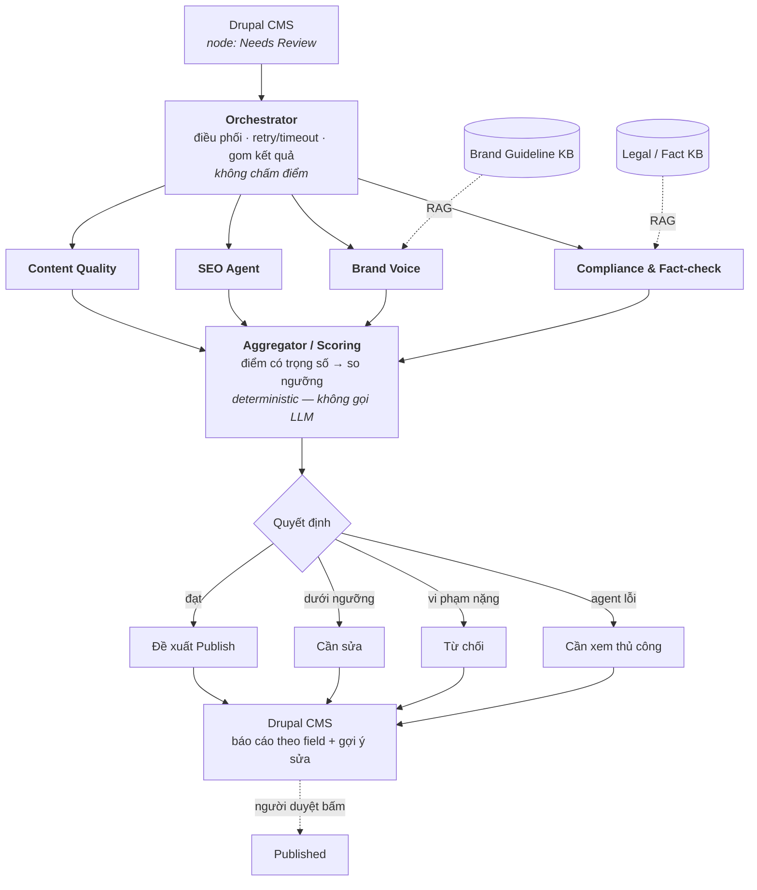

# Phạm vi "nội dung Marketing" và kiến trúc đánh giá

**Ngày:** 2026-07-24
**Trạng thái:** Chốt

Tài liệu này trả lời một câu hỏi duy nhất: **"nội dung Marketing" trong đề tài là gì**, và chốt kiến trúc đánh giá tương ứng. Đây là tài liệu tham chiếu chuẩn về phạm vi; mọi rubric, gold set và tiêu chí chấm điểm phải nhất quán với nó.

---

## 1. Định nghĩa phạm vi

> **Bài cẩm nang / hướng dẫn tiếng Việt về xe điện** trên vinfastauto.com (dạng URL `/vn_vi/<slug>`), ở trạng thái **chưa xuất bản** trong Drupal, được đánh giá trên **từng field** theo 4 nhóm tiêu chí, kết quả trả về dưới dạng báo cáo gợi ý sửa cho người duyệt.

Ba tên gọi *blog* / *bài SEO* / *bài cẩm nang* chỉ **cùng một loại nội dung**. Toàn bộ tài liệu dự án dùng thống nhất thuật ngữ **"bài cẩm nang"**.

### 1.1 Bối cảnh

Dự án nhắm vào **VinFast**, mảng kinh doanh **O2O (Online-to-Offline)**. Ngành là ô tô điện / xe máy điện, không phải "công nghệ" chung chung. Lựa chọn này quyết định bộ quy tắc Compliance và nguồn brand guideline.

### 1.2 Ngôn ngữ: tiếng Việt

Lý do chọn tiếng Việt thay vì tiếng Anh:

1. **Chất lượng nhãn.** Người gán nhãn gold set là tác giả dự án. Nhãn tiếng Việt đáng tin cậy hơn hẳn, mà toàn bộ F1 / Cohen's Kappa ở Sprint 3 đều đo mức khớp với nhãn này. Nhãn kém tin cậy làm mọi chỉ số phía sau vô nghĩa.
2. **Tính nghiên cứu.** Tiếng Anh chỉ cần lắp thư viện có sẵn (`textstat`, `LanguageTool`). Tiếng Việt buộc phải giải quyết vấn đề thật: Flesch-Kincaid không áp dụng được, cần tách từ, spell-check yếu — đây là phần nội dung nghiên cứu của đề tài.
3. **Căn cứ pháp lý.** Compliance dựa vào Luật Quảng cáo 2012, Luật Cạnh tranh 2018 — trích dẫn được, đúng yêu cầu "mọi ngưỡng phải có chứng cứ".
4. **Người chấm kiểm chứng được** kết quả ngay trong demo.

### 1.3 Xử lý các thách thức của tiếng Việt

| Thách thức | Giải pháp |
|---|---|
| Flesch-Kincaid không dùng được | Chỉ số tự định nghĩa: độ dài câu trung bình, tỉ lệ câu > 30 từ, tỉ lệ đoạn > 5 câu — calibrate ngưỡng từ gold set |
| Tách từ (word segmentation) | `underthesea`, chỉ dùng cho keyword density |
| Spell/grammar check yếu | Giao cho LLM — không phát sinh hạ tầng mới |

---

## 2. Phân tầng ưu tiên

Nguyên tắc: **hoàn thành phần bắt buộc thật sâu trước, mở rộng sau nếu còn thời gian.** Không cắt bỏ vĩnh viễn, chỉ xếp thứ tự.

| Tầng | Nội dung | Ghi chú |
|---|---|---|
| **P0 — bắt buộc** | Bài cẩm nang tiếng Việt: gold set 30–50 mẫu, 4 agent, end-to-end trên Drupal, calibration ngưỡng có bằng chứng | Không được trượt |
| **P1 — nếu P0 xong sớm** | Landing page / trang sản phẩm (~8 mẫu generalization test, không nhập vào gold set chính) | Vài ngày |
| **P2 — thừa thời gian** | Thông cáo báo chí, case study | Vài ngày |
| **Định hướng — chỉ viết tài liệu** | Đa ngôn ngữ (tiếng Anh) | Không code trong phạm vi dự án |

### 2.1 Vì sao 30–50 mẫu chỉ dành cho một loại nội dung

Con số 30–50 do đề bài ấn định. Chia cho nhiều loại nội dung thì mỗi loại còn ~10 mẫu, khiến Cohen's Kappa có khoảng tin cậy quá rộng và **không calibrate được ngưỡng ở Sprint 3** — đúng deliverable quan trọng nhất.

### 2.2 Đa ngôn ngữ nằm ở tầng khác hẳn P1/P2

Thêm content type mới dùng lại được ngôn ngữ và người gán nhãn. Thêm ngôn ngữ mới thì phá vỡ nền móng: cần gold set thứ hai đầy đủ, calibrate lại toàn bộ ngưỡng, và cần người bản ngữ gán nhãn.

**Kết luận: kể cả còn thời gian cũng không code đa ngôn ngữ.** Gold set tiếng Anh 10 mẫu với ngưỡng copy từ tiếng Việt sẽ mất điểm đúng ở chỗ dự án đang mạnh nhất.

Thay vào đó, giữ 3 nguyên tắc thiết kế (chi phí gần bằng 0 nếu làm từ đầu):

1. `langcode` là tham số đầu vào của Orchestrator và mọi agent — không hard-code `"vi"`
2. Rubric và ngưỡng lưu theo khóa `(content_type, langcode)` trong config — cùng cơ chế phục vụ cả hai trục mở rộng
3. Tách lớp phân tích ngôn ngữ sau interface `LanguageAnalyzer` (tách từ, đếm câu, readability). Hiện chỉ implement `VietnameseAnalyzer`; thêm ngôn ngữ mới là thêm một class, không đụng vào 4 agent

Brand Voice RAG phân vùng vector store theo `langcode`.

**Bối cảnh thực tế:** vinfastauto.com có bản tiếng Anh song song (`/vn_en/`), xác nhận Drupal multilingual đang chạy thật.

---

## 3. Đơn vị đánh giá: node và field

Đầu vào là một **node Drupal** ở trạng thái chưa xuất bản. Báo cáo trả về **theo từng field**:

| Field | Nội dung |
|---|---|
| `title` | Tiêu đề |
| `body` | Nội dung chính (HTML) |
| `summary` | Tóm tắt / teaser |
| Meta title, meta description | Module Metatag |
| URL alias (slug) | Module Pathauto |
| Ảnh + `alt text` | |
| Taxonomy | Category, tag |

Node mang sẵn `langcode` do Drupal cung cấp — hệ thống **không phải tự đoán ngôn ngữ**.

---

## 4. Bốn nhóm tiêu chí

| Mục tiêu đề tài | Agent | Đánh giá |
|---|---|---|
| Nâng cao chất lượng nội dung | **Content Quality** | Chính tả, ngữ pháp, cấu trúc, readability, trùng lặp, mạch lạc, tín hiệu độ tin cậy (có tác giả, số liệu có nguồn, có ngày cập nhật) |
| Tối ưu SEO | **SEO** | Keyword density, H1–H3, meta title/description, độ dài, internal link, alt text, slug, **content freshness** |
| Nhất quán thương hiệu | **Brand Voice** (RAG) | Giọng văn, thuật ngữ chuẩn, từ cấm, đối chiếu brand guideline |
| Kiểm duyệt | **Compliance & Fact-check** (RAG) | Claim quảng cáo quá đà, vi phạm luật, số liệu không nguồn |

### 4.1 Claim đặc thù xe điện mà Compliance phải bắt

| Claim | Vấn đề |
|---|---|
| *"Chạy được 450km mỗi lần sạc"* | Thiếu điều kiện đo (NEDC/WLTP), thiếu lưu ý thực tế khác |
| *"Sạc đầy trong 30 phút"* | Thiếu loại trụ sạc, thiếu dải phần trăm |
| Chính sách pin / thuê pin | Thiếu điều kiện, phí, thời hạn |
| *"Ưu đãi giảm 200 triệu"* | Luật Thương mại: khuyến mại phải có thời hạn rõ ràng |
| *"Số 1"*, *"tốt nhất"*, *"duy nhất"* | Luật Quảng cáo 2012 — cấm nếu không có tài liệu chứng minh |
| So sánh trực tiếp với đối thủ | Luật Cạnh tranh 2018 — cấm so sánh trực tiếp |

### 4.2 Lưu ý về "tín hiệu độ tin cậy"

Không dùng thuật ngữ **E-E-A-T** trong tài liệu. Đó là khái niệm định tính của Google, không có công thức đo — đưa vào rubric sẽ thành chấm cảm tính, mâu thuẫn yêu cầu "không ngưỡng nào là số ảo". Chỉ lấy phần đo được và gọi đúng tên là *tín hiệu độ tin cậy*.

---

## 5. Kiến trúc

### 5.1 Bốn quyết định thiết kế

**Không tự động xuất bản.** Hệ thống chỉ *đề xuất* Publish; người duyệt bấm nút cuối cùng. Đúng tinh thần đề bài — "hỗ trợ quy trình kiểm duyệt", không thay thế người duyệt. Hệ thống chỉ được phép tự chuyển node về `Draft` khi cần sửa.

**Orchestrator và Aggregator tách bạch.** Orchestrator chỉ điều phối, retry, timeout, gom kết quả thô — không tính điểm. Aggregator nhận 4 kết quả, tính điểm có trọng số, so ngưỡng, ra quyết định, sinh báo cáo.

**Aggregator là module tất định, không gọi LLM.** Nếu để LLM tự phán điểm tổng thì chạy hai lần ra hai kết quả khác nhau, và **không calibrate được ngưỡng từ gold set** — phá hỏng deliverable của Sprint 3.

**Agent lỗi không bị cho điểm 0.** Sau khi retry hết mà agent vẫn timeout, tiêu chí đó được đánh dấu *"không đánh giá được"* và node chuyển sang nhánh **cần xem thủ công**. Cho điểm 0 sẽ khiến bài bị từ chối oan vì lỗi hạ tầng.

---

## 6. Dữ liệu

### 6.1 Ràng buộc: không có dữ liệu nội bộ

Dự án **không được cấp** draft chưa duyệt, brand guideline nội bộ, hay quyền truy cập Drupal thật của VinFast. Toàn bộ dữ liệu lấy từ **nguồn công khai**.

Điều này có hai lợi thế: tài liệu và demo được trình bày đầy đủ mà không vướng bảo mật, và hội đồng **tự kiểm chứng được** mọi dẫn chứng.

### 6.2 Gold set

Nguồn: bài cẩm nang công khai trên vinfastauto.com (URL phẳng `/vn_vi/<slug>`).

**Không lấy** bài thuộc mục "Công ty" trong `/tin-tuc` — đó là thông cáo báo chí, thuộc tầng P2, và sẽ kéo lệch gold set.

Thành phần: **~60% bài thật / ~40% bài chèn lỗi có chủ đích** (perturbation). Phân chia cụ thể `BRAND`/`GOLD`/`PERT` và quy tắc gán nhãn: `docs/goldset/sources.md` mục 1.6 và `docs/goldset/annotation-guideline.md`.

Bài đã publish vẫn chứa lỗi tự nhiên — khảo sát thực tế đã tìm được:
- Tiêu đề viết hoa toàn bộ: *"LƯU Ý SỬ DỤNG ĐỐI VỚI PIN CELL LFP/GOTION"*, *"ĐĂNG KÝ ĐẠI LÝ ỦY QUYỀN... CƠ HỘI VÀNG BỨT PHÁ DOANH THU"* → lỗi brand voice
- Tiêu đề gắn năm cũ: *"...lưu ý đúng cách 2024"* → nội dung lỗi thời

Perturbation bù các loại lỗi hiếm không xuất hiện tự nhiên (claim vi phạm luật, thiếu meta description). Ưu điểm: ground truth chính xác tuyệt đối và kiểm soát được phân bố lỗi.

**Thu thập thủ công.** Site có WAF chặn bot (HTTP 403). Với 30–50 mẫu, thu thủ công là khả thi và bắt buộc phải đọc từng bài để gán nhãn — không mất gì thêm. Không viết crawler.

### 6.3 Boilerplate removal — chỉ ở khâu thu thập

Khảo sát xác nhận header, footer và **khối CTA cuối bài** (mời lái thử, hotline, showroom) là **template dùng chung**, gần như giống hệt giữa các bài.

| Luồng | Nguồn | Có boilerplate? |
|---|---|---|
| Hệ thống chạy thật | Drupal node → field `body` qua JSON:API | **Không** — field `body` chỉ chứa nội dung tác giả viết |
| Thu thập gold set | Crawl/copy từ web công khai | **Có** — phải bóc lấy phần nội dung |

**Boilerplate removal thuộc về công cụ thu thập gold set, không thuộc kiến trúc runtime.** Đưa nó vào Orchestrator là giải quyết vấn đề mà pipeline thật không có.

### 6.4 Brand guideline: tự trích xuất từ corpus

Không có tài liệu nội bộ, nên brand guideline được **suy ra từ dữ liệu**: lấy 30–50 bài đã publish (đã qua kiểm duyệt nên coi là đại diện chuẩn brand) rồi thống kê:

- Xưng hô: *"khách hàng"* / *"quý khách"* / *"bạn"* / *"người dùng"*
- Thuật ngữ chuẩn: *"ô tô điện"* hay *"xe hơi điện"*
- Cách viết tên model: `VF 8` hay `VF8`
- Độ dài câu trung bình, cấu trúc heading, mức độ trang trọng

Kết quả ghi thành `brand_guideline.md`, nạp vào RAG.

**Corpus này phải rời hẳn gold set** (tập `BRAND` vs `GOLD`/`PERT` - `docs/goldset/sources.md` mục 1.6). Dùng chung một tập cho cả hai việc là rò rỉ dữ liệu: Brand Voice Agent bị chấm trên chính dữ liệu đã sinh ra quy tắc của nó, điểm cao thu được không chứng minh được gì.

Mỗi quy tắc **chứng minh được bằng số** — ví dụ *"92% bài dùng 'ô tô điện' → chọn làm thuật ngữ chuẩn"*. Áp dụng đúng tinh thần "không có ngưỡng nào là số ảo" cho cả brand guideline.

### 6.5 Grounding vào vinfastauto.com

Nguyên tắc: mọi nguyên liệu của hệ thống đều rút từ nội dung thật, công khai trên vinfastauto.com — để hội đồng chấm tự mở site đối chiếu và verify được. Đây là điểm khác biệt so với chạy trên dữ liệu giả định.

| Thành phần | Nguồn thật | 
|---|---|
| Gold set | Bài cẩm nang `/vn_vi/<slug>` |
| Brand guideline (RAG) | Thống kê từ corpus bài đã publish |
| Fact-check KB (RAG) | Trang thông số model công bố (VF 3/5/6/7/8/9, e34) |
| Từ điển thuật ngữ | Tên model chuẩn, "ô tô điện", "pin LFP"... quan sát từ site |
| Rule Compliance | Claim thật trên site + Luật QC 2012 |
| Cấu trúc Drupal local | Mirror content type/field/URL pattern quan sát từ site |

Danh sách URL thật đã thu thập (≈40 bài cẩm nang ứng viên + 7 trang thông số) và số liệu đối chiếu: `docs/goldset/sources.md`.

**Grounding ≠ mở rộng vùng phủ.** Bám sát site là để lấy *nguyên liệu thật*, vẫn giữ đúng phạm vi P0 (cẩm nang) — không ôm tin tức/PR, không scrape cả site.

---

## 7. Ngoài phạm vi

- **Sinh nội dung từ đầu** — hệ thống chỉ đánh giá và gợi ý sửa
- **Tự động xuất bản** — quyết định cuối luôn thuộc về người duyệt
- Quản lý quảng cáo, email automation, social scheduling
- Đánh giá hình ảnh / video (chỉ kiểm `alt text`)
- Nội dung ngoài Drupal
- Nội dung tiếng Anh (xem mục 2.2)
- Thông cáo báo chí mục "Công ty" (tầng P2)

### 7.1 Tiêu chí O2O Conversion Readiness — đã cân nhắc và loại bỏ

Từng đề xuất một tiêu chí riêng kiểm bài viết có dẫn người đọc tới hành động offline không (CTA lái thử, link showroom, hotline), với lý do đây là nghiệp vụ cốt lõi của mảng O2O.

**Đã loại bỏ sau khi kiểm chứng thực tế.** Khối CTA là template dùng chung, gần như giống hệt ở mọi bài, và **không nằm trong field `body`**. Hệ quả:

- Mọi bài đều pass → tiêu chí là **hằng số**, không phân biệt được bài tốt/xấu → đóng góp bằng 0 cho F1, trọng số trong Aggregator vô nghĩa
- Nội dung đó **không thuộc quyền kiểm soát của người viết** — báo lỗi cũng không sửa được

Ghi lại quyết định này vì nó thể hiện đúng nguyên tắc: **một tiêu chí chỉ có giá trị khi nó phân biệt được.**
